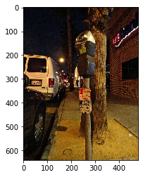

# Machine Learning in Image Processing

· PR1: Implement a Back-propagation algorithm to recognize hand-written digits from 0-9.

· PR2: Recognizing hand-written digits from 0-9 using Convolutional Neural Network (CNN) and PyTorch.

· PR3: Bird species Classification using VGG-16 and ResNet18.

· PR4: Image denoising with DnCNN, U-net like CNNs and U-net like CNNs with dilated convolutions.

· Group Project: Image Captioning with CNN as encoder and RNN as a decoder

## PR1: Back-propagation using MNIST dataset

This assignment focuses on multiclass classification on the MNIST Dataset. I implement a simple Neural Network and backpropagation algorithm.  The MNIST Dataset consists of labeled images of handwritten digits from 0 to 9. Each image is 28 by 28 pixels (784 pixels). In this project, I implement a shallow neural network with a single hidden layer and ReLU as an activation function. The output layer uses Softmax as an activation function. There are 64 neurons in the hidden layer and 10 neurons in the output layer.

The classification accuracy is around 95.52%.

## PR2: Implement Convolutional Neural Network using MNIST dataset

Same as PR1, but this time, I implement with CNN and PyTorch.

The classification accuracy is around 98.07%.

## PR3: Bird species classification using VGG-16 and ResNet-18

In this project, I use transfer learning to solve a classification problem. In this project, I get familiar with using PyTorch’s DataLoader and creating checkpoints to stop and restart model training. We want to learn how to predict the species of a bird given its picture. We use Caltech-UCSD Birds-200-2011 (CUB-200-2011) dataset. 

The results are demonstrated below:

| Network   | Classification Accuracy | Training and validation curves                           |
| --------- | ----------------------- | -------------------------------------------------------- |
| VGG-16    | 84.51%                  |        |
| ResNet-18 | 81.25%                  |  |

## PR4: Image denoising with DnCNN, U-net like CNNs and U-net like CNNs with dilated convolutions.

In this assignment, I implement a specific regression problem: image denoising. We will be using deep Convolutional Neural Networks (CNNs) with PyTorch, investigate DnCNN and U-net architectures. We use images from the “Berkeley Segmentation Dataset and Benchmark” (https://www2.eecs.berkeley.edu/Research/Projects/CS/vision/bsds/). This directory contains two sub-directories: train and test, which consist of 200 and 100 images, respectively, of either size 321 × 481 or 481 × 321. We can use a small training set for image denoising because denoising each pixel of an image can be seen as one regression problem. Hence, our training is composed of 200×321×481 ≈ 31 million samples.

The DnCNN structure is demonstrated as the following figure:

The performance is evaluated using Peak Signal-to-Noise-Ratio (PSNR). In this project, we set D = 6. In this project, I implement 3 architectures - DnCNN, U-net like CNNS and U-net like CNNs with dilated convolutions. The results are demonstrated below:

| Structure                                 | PSNR      | Training Curves                                          |
| ----------------------------------------- | --------- | -------------------------------------------------------- |
| DnCNN                                     | 28.90     |                |
| U-Net like CNNS                           | 29.00     |                  |
| U-net like CNNs with dilated convolutions | __29.26__ |  |

Some qualitative comparison:

​                 

## PR5: Image Captioning

Our network used in this project has a structure of CNN+RNN, and it is based on the Show and Tell paper.
For the CNN part, we tried resnet152 and resnet50. For the RNN part, we tried LSTM and GRU.

- The best result is produced by the second model below

resnet152+lstm+hidden_size1024+lr_1e3: Bleu_4_C5 = 0.235378 CIDEr_C5 = 0.748013

**resnet152+lstm+hidden_size512+lr_1e3: Bleu_4_C5 = 0.242659 CIDEr_C5 = 0.772517**

resnet152+gru+hidden_size512+lr_1e3: Bleu_4_C5 = 0.235254 CIDEr_C5 = 0.750898

resnet152+gru+hidden_size1024+lr_1e3: Bleu_4_C5 = 0.234776 CIDEr_C5 = 0.749187

resnet50+lstm+hidden_size1024+lr_1e3: Bleu_4_C5 = 0.237044 CIDEr_C5 = 0.749605

resnet152+lstm+hidden_size512+lr_1e-2: Bleu_4_C5 = 0.222249 CIDEr_C5 = 0.695748

Some qualitative results:

|  |  |
| -------------------------------------- | -------------------------------------- |
|  |  |
|  |  |

